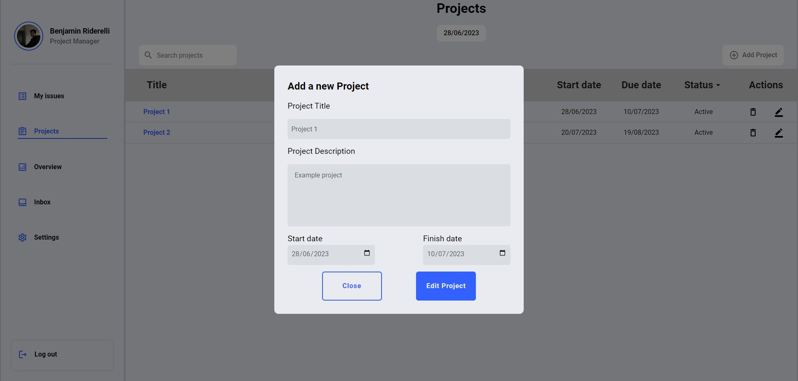
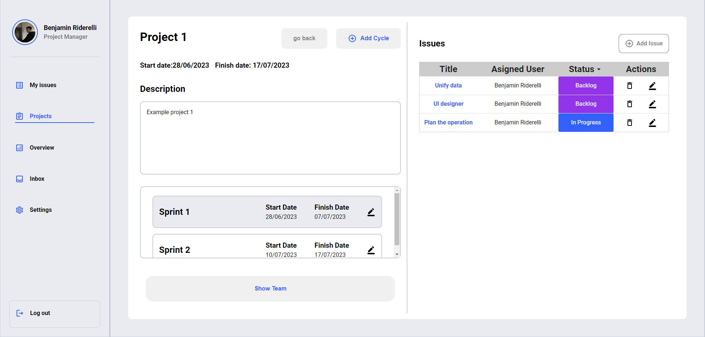

# Maki

Maki is a simple and user-friendly Project Management App. It consists in Teams, Projects, Cycles and Issues so anyone in the team can have
a 360 degree view of what needs to be done for a project to be completed

## Index

1. Project description
2. Platform overview
3. Used technologies
4. Instalation
5. Comments

# Project description

Maki was made as part of Nuclio's school Full-stack course. The asignment was ment to push me to make a "Linear.app" copy cut, but giving it a personal twist. At the time, I havent had used Linear.app, so the first step was to break down the DB schema and turn it into something manageable in the time scope given, this is what I came out with:


Here, we can see that basically the App's structure consists in 6 main schemas: Teams, that have users, pending users, and an administrator wich are all refered in the User schema, then we have Issues, that have a status (Enum), User and a Cycle asigned, Cycles that have a Project and finally Projects that just contain specific project data. Finally, notifications are used to transfer information between users, for now, they are ment to be just invitations.

With this simple DB schema you can make powerful planning through dates and stages, because in the end, its all about breaking big parts into smaller pieces.

# Platform overview

### Login / Register Page

To plan your projects you first have to be registered, right? here are the register and login pages:


### My-Issues tab

This view is planned to give you an instant feedback of your pending and done issues, while giving you the posibility of creating new ones and updating the status in the kanban view, the filter works with the issue's name in both list and Kanban view.


### Projects tab

In this view you can see the projects that you have created and the one's you're part of, by clicking into their name, you can access the detailed view of the project, listing the details of the project, it's cycles, issues and users. You can also add new cycles (or edit them) and issues, as well as invite new users to join this project from this view.

in the list view of the projects, you can modify their data by clicking in the "edit" button placed on the top right of the table.






### Overview tab

from this view the user can see the list and kanban of issues with a set of filters: Project, cycles, and users. Issues can also be updated and added from this view, just as in "My-Issues" tab.


### Notifications tab

In this view the user recieves invitations for new projects, when a user invites anotherone, it creates a notification so the invited user can accept the invitation and be part of the project. Invitations also have a "seen" state, indicating the user wether he or she has something to be attended. Once the user reads the notification, it automatically changes the state, and indicates that he or she has one less unread message


### Settings Page

Want to change your profile picture? (even though I know you will love the default one, I mean, who's not a one piece fan nowatdays)
Here you can update your profile information such as your name, lastname, email, and profile picture. You can also change your general role if you want to.


# Tecnologías utilizadas

### Front-End libraries:

- React
- React-Router-Dom
- React-Hook-Form
- React-Query
- Axios
- Beautifull Drag and drop
- Material UI

### Back-End Libraries:

- Express
- Mongoose
- Cloudinary
- JWT

# Instalación

## 1. Pre-requisites

You must first have installed in your computer:

- Node.js
- MongoDB

## 2. Configuración:

- Clone this Monorepo

```
$ git clone https://github.com/nds-fsd/linear.git
```

- Install dependencies:

```
$ npm install
```

- Make some docker magic happen:

```
$ docker compose up -d
```

- Create a .env file in the backend directory and specify the following environment variables

```
PORT : 3001
MONGO_URL: [ ]
JWT_SECRET: [ ]
```

- Initialize dev environment:

```
$ npm run dev
```

- To start using the aplication through your browser:

```
http://localhost:3000/
```

- Deployed version: https://makisolutions.netlify.app/login (proabably not usable by the time you read this)

# Comments

Building this project was the perfect excuse to try different aproaches to problems without compromising a real project in progress. I've learned so much about Promises, Hooks, Git, managing data, entity relationship and using new libraries that going into detail would be a project on its own.

 Special thanks to all the teachers at Nuclio school and their evident passion for teaching and for technology.
